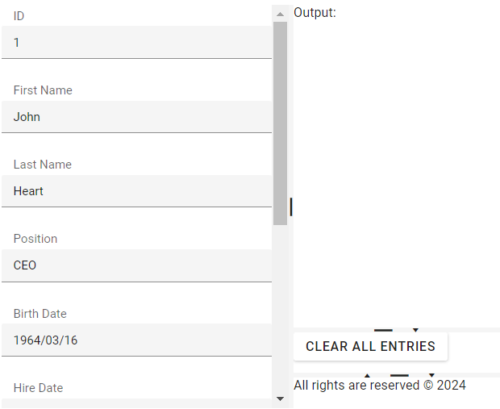

<!-- default badges list -->

<!-- default badges end -->
# DevExtreme Splitter - Getting Started

This repository stores code for the following DevExpress tutorial: [Getting Started with DevExtreme Splitter](https://js.devexpress.com/Documentation/Guide/UI_Components/Splitter/Getting_Started_with_Splitter/). The project creates a UI component that splits a page layout into multiple panes.

## Files to Review

- **jQuery**
    - [index.js](jQuery/src/index.js)
- **Angular**
    - [app.component.html](Angular/src/app/app.component.html)
    - [app.component.ts](Angular/src/app/app.component.ts)
- **Vue**
    - [Home.vue](Vue/src/components/HomeContent.vue)
- **React**
    - [App.js](React/src/App.js)

## Documentation

- [Getting Started with Splitter](https://js.devexpress.com/Documentation/Guide/UI_Components/Splitter/Getting_Started_with_Splitter/)

- [Splitter - API Reference](https://js.devexpress.com/Documentation/ApiReference/UI_Components/dxSplitter/)
